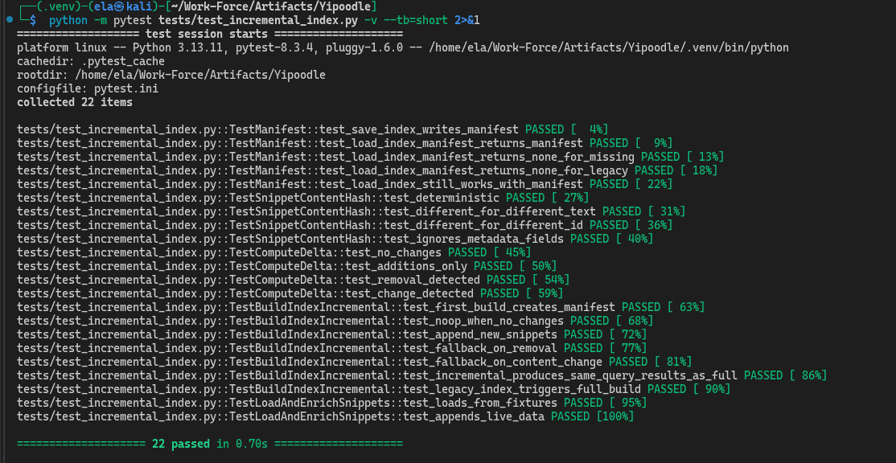
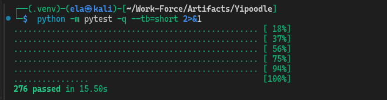

# Yipoodle

**Offline Research Copilot & Tiny GPT Engine**

Yipoodle is a fully offline, deterministic research automation platform that discovers academic papers, extracts and indexes their content, synthesizes evidence-grounded research reports, and validates every claim against source material. It also includes a from-scratch character-level GPT model for local text generation.

No cloud LLM APIs are required. Everything runs on a consumer CPU.

---

## Problem Statement

Researchers and engineers face three persistent problems:

1. **Information overload** — keeping up with papers across arXiv, Semantic Scholar, OpenAlex, and 15+ other sources is manual and time-consuming.
2. **Ungrounded AI summaries** — LLM-generated summaries frequently hallucinate facts, fabricate citations, and introduce numbers that don't exist in sources.
3. **No reproducibility** — most research tooling is stateless; there's no audit trail, no quality gates, and no way to replay a run.

Yipoodle solves all three by building a fully deterministic pipeline: every synthesis sentence is traceable to a specific snippet from a specific paper, every report is validated for citation coverage and faithfulness, and every run produces a reproducible snapshot.

---

## Key Features

| Category               | Capabilities                                                                                                                                            |
| ---------------------- | ------------------------------------------------------------------------------------------------------------------------------------------------------- |
| **Paper Discovery**    | 18 source connectors (arXiv, OpenAlex, Semantic Scholar, Crossref, DBLP, PapersWithCode, CORE, OpenReview, GitHub, Zenodo, and more) with retry/backoff |
| **PDF Extraction**     | Multi-extractor fallback chain (pypdf → pymupdf → pdfminer.six), two-column reconstruction, layout engine (legacy/v2/shadow), optional Tesseract OCR    |
| **Indexing**           | BM25 lexical index + optional FAISS vector index (flat, IVF, HNSW) with sharding support                                                                |
| **Retrieval**          | Lexical, vector, or hybrid retrieval with section-aware weighting, metadata priors (recency, venue, citations), and quality-aware scoring               |
| **Research Synthesis** | Deterministic report generation with cited evidence, key claims, research gaps, and experiment proposals — zero LLM hallucination by design             |
| **Validation**         | Citation format checking, fabrication detection, claim-evidence support scoring, semantic faithfulness (offline embeddings + optional online judge)     |
| **Knowledge Base**     | SQLite-backed long-lived KB with claim versioning, contradiction detection, confidence decay, and FTS5 search                                           |
| **Live Sources**       | REST/RSS/scrape connectors for real-time data with snapshot caching and intent-routed source packs                                                      |
| **Monitoring**         | Recurring topic watches with cron scheduling, threshold-based alerting (webhook + Gmail SMTP), cooldown/hysteresis noise control                        |
| **Automation**         | Full cron-driven pipeline: sync → extract → health gate → index → research → validate → KB ingest → alert dispatch                                      |
| **Automation Workflows** | CI pipeline, benchmark regression gate/history, source reliability watchdog, research templates, file-watch ingestion                                  |
| **Query Router**       | Smart routing of prompts to ask/research/monitor/notes modes with deterministic intent detection                                                        |
| **Tiny GPT**           | From-scratch character-level transformer (multi-head attention, pre-norm blocks, top-k sampling) for local text generation                              |
| **Reproducibility**    | Snapshot bundles, run manifests, audit trails, extraction quality reports, benchmark harnesses                                                          |

---

## System Architecture

```
┌─────────────────────────────────────────────────────────────────┐
│                         CLI (src/cli.py)                        │
│              ~40 subcommands — single entry point               │
└─────────────┬───────────┬──────────┬──────────┬─────────────────┘
              │           │          │          │
     ┌────────▼───┐  ┌────▼────┐  ┌-─▼─────┐  ┌-▼─────────────┐
     │  Research  │  │ Tiny    │  │ Query  │  │  Automation   │
     │  Pipeline  │  │ GPT     │  │ Router │  │  Engine       │
     └──────┬─────┘  └────┬────┘  └───┬────┘  └──────┬────────┘
            │              │          │               │
   ┌────────┼──────────┐   │    ┌─────┼────┐    ┌─────┼────────┐
   │        │          │   │    │     │    │    │     │        │
┌──▼──┐  ┌──▼──┐   ┌───▼┐  │  ┌─▼─┐ ┌─▼─┐ ┌▼─┐  │  ┌──▼──┐  ┌-─▼─┐
│Sync │  │Index│   │Ret-│  │  │Ask│ │Mon│ │No│  │  │Alert│  │Cron│
│Paper│  │Build│   │riev│  │  │   │ │ito│ │te│  │  │Disp │  │Schd│
│     │  │     │   │al  │  │  │   │ │r  │ │s │  │  │atch │  │    │
└──┬──┘  └──┬──┘   └─┬──┘  │  └───┘ └───┘ └──┘  │  └─────┘  └────┘
   │        │        │     │                    │
┌──▼────────▼──────-─▼────-▼────────────────────▼────────────────┐
│                     Core Data Layer                            │
│  SQLite (papers.db)  │  JSON artifacts  │  KB (knowledge.db)   │
│  FAISS vectors       │  BM25 indexes    │  Live snapshots      │
└────────────────────────────────────────────────────────────────┘
```

For the full architecture document, see [docs/architecture.md](docs/architecture.md).

---

## Tech Stack

| Component        | Technology                                                   |
| ---------------- | ------------------------------------------------------------ |
| Language         | Python 3.11+                                                 |
| ML Framework     | PyTorch 2.5                                                  |
| Embeddings       | sentence-transformers (all-MiniLM-L6-v2)                     |
| Vector Search    | FAISS (flat, IVF, HNSW)                                      |
| Lexical Search   | Custom BM25 implementation                                   |
| PDF Extraction   | pypdf (primary), pymupdf & pdfminer.six (optional fallbacks) |
| OCR              | Tesseract CLI (optional)                                     |
| Databases        | SQLite (papers + KB)                                         |
| Data Formats     | JSON, YAML, Markdown                                         |
| HTTP             | requests (with retry/backoff)                                |
| Validation       | Pydantic 2.x                                                 |
| Testing          | pytest (254 tests)                                           |
| Containerization | Docker (CPU + CUDA images)                                   |
| Task Runner      | Make                                                         |

---

## Installation & Setup

### Prerequisites

- Python 3.11+
- Git

### Quick Start

```bash
# Clone the repository
git clone https://github.com/Ela-El-maker/yipoodle.git
cd yipoodle

# Create and activate virtual environment
python -m venv .venv
source .venv/bin/activate

# Install dependencies
pip install -r requirements.txt

# Verify installation
python -m src.cli --help

# Run tests
pytest -q
```

### Optional Dependencies

```bash
# Better PDF extraction (fallback extractors)
pip install pymupdf pdfminer.six

# OCR support (requires Tesseract binary)
sudo apt-get install tesseract-ocr
```

### Production Profiles

Pinned deployment profiles are provided under `deploy/`:

```bash
# CPU-only
pip install -r deploy/requirements.cpu.txt

# CUDA 12.1
pip install --extra-index-url https://download.pytorch.org/whl/cu121 -r deploy/requirements.cuda12.txt
```

---

## Deployment & DevOps Workflows

### CI/CD and Version-Control Triggers

- Pull requests automatically run lint + tests + quality gates (`query-router-eval`, `extraction-eval`).
- Pushes to `main`/tags run the same gates and then publish a CPU container image to GHCR.
- Workflow file: `.github/workflows/ci.yml`.

### Automated Environment Setup

```bash
# Bootstrap local environment (venv + deps + standard data/run directories)
bash scripts/bootstrap_env.sh --profile cpu

# Optional profiles
bash scripts/bootstrap_env.sh --profile dev
bash scripts/bootstrap_env.sh --profile cuda12
```

### Container Provisioning

```bash
# Build and run CPU compose stack
make docker-compose-cpu-up

# Stop stack
make docker-compose-cpu-down
```

---

## Environment Variables

| Variable             | Required | Description                                           |
| -------------------- | -------- | ----------------------------------------------------- |
| `UNPAYWALL_EMAIL`    | No       | Email for Unpaywall OA PDF enrichment                 |
| `GMAIL_APP_PASSWORD` | No       | Gmail App Password for email alert dispatch           |
| `OPENAI_API_KEY`     | No       | API key for optional online semantic validation judge |

---

## Usage

### 1. Train the Tiny GPT Model

```bash
python -m src.cli train-tinygpt --data data/data.txt --config config/train.yaml
```

### 2. Generate Text

```bash
python -m src.cli generate --checkpoint runs/checkpoints/<id>.pt --prompt "Research:"
```

### 3. Run the Full Research Pipeline (One Command)

```bash
python -m src.cli run-pipeline \
  --query "mobile segmentation limitations" \
  --sources-config config/sources.yaml \
  --with-semantic-scholar
```

This executes: sync papers → extract PDFs → corpus health check → build index → research report → validate report.

### 4. Step-by-Step Research Workflow

```bash
# Sync papers from academic sources
python -m src.cli sync-papers --query "transformer attention mechanisms" \
  --max-results 20 --with-semantic-scholar

# Extract text from downloaded PDFs
python -m src.cli extract-corpus --papers-dir data/papers \
  --out-dir data/extracted --db-path data/papers.db

# Build retrieval index
python -m src.cli build-index --corpus data/extracted \
  --out data/indexes/bm25_index.json --db-path data/papers.db

# Generate research report
python -m src.cli research --index data/indexes/bm25_index.json \
  --question "What are current limitations of transformer models?" \
  --top-k 8 --out runs/research_reports/report.md

# Validate the report
python -m src.cli validate-report --input runs/research_reports/report.md \
  --evidence runs/research_reports/report.evidence.json
```

### 5. Query Router (Smart Prompt Dispatch)

```bash
# Arithmetic → ASK mode
python -m src.cli query --question "23 + 34 = ?"

# Definition → ASK mode
python -m src.cli query --question "What is an algorithm?"

# Research → RESEARCH mode
python -m src.cli query --question "Compare ViT and CNN tradeoffs" \
  --index data/indexes/bm25_index.json

# Monitoring → MONITOR mode
python -m src.cli query --question "Monitor NVIDIA stock signals"

# Notes → NOTES mode
python -m src.cli query --question "Create study notes on transformer failure modes" \
  --index data/indexes/bm25_index.json
```

### 6. Make Shortcuts

```bash
# Local report from existing corpus
make report-local QUERY="mobile segmentation limitations"

# Full pipeline: sync → extract → report
make report QUERY="mobile segmentation limitations"

# Run all tests
make test
```

### 7. Automation Workflow Commands

```bash
# Run template-driven multi-query session
python -m src.cli research-template \
  --template lit_review \
  --topic "mobile segmentation" \
  --index data/indexes/bm25_index.json

# Reliability watchdog from latest automation run
python -m src.cli reliability-watchdog \
  --run-dir runs/audit/runs/<run_id> \
  --config config/automation.yaml

# Resolve disputed KB contradictions with targeted follow-up research
python -m src.cli kb-contradiction-resolve \
  --kb-db data/kb/knowledge.db \
  --topic finance_markets \
  --index data/indexes/bm25_index.json \
  --out-dir runs/audit/kb_resolution/finance_markets

# Benchmark regression gate against historical baseline
python -m src.cli benchmark-regression-check \
  --benchmark runs/research_reports/automation/<run_id>/benchmark.json \
  --history runs/audit/benchmark_history.json \
  --max-latency-regression-pct 10 \
  --min-quality-floor 0.5

# Optional automation cadence control:
# config/automation.yaml -> benchmark_regression.run_every_n_runs: 5

# One-shot watch ingestion for dropped PDFs
python -m src.cli watch-ingest \
  --dir data/papers \
  --once \
  --db-path data/papers.db \
  --extracted-dir data/extracted \
  --index data/indexes/bm25_index.json
```

Scheduled digest flush:

```bash
# Daily at 08:00 UTC
0 8 * * * cd /path/to/yipoodle && .venv/bin/python -m src.cli monitor-digest-flush --config config/automation.yaml
```

---



## Domain Configurations

Prebuilt domain configs under `config/domains/` for targeted research:

| Domain                 | Config File                                          |
| ---------------------- | ---------------------------------------------------- |
| NLP                    | `config/domains/sources_nlp.yaml`                    |
| Biomedical AI          | `config/domains/sources_biomed_ai.yaml`              |
| Robotics               | `config/domains/sources_robotics.yaml`               |
| Cybersecurity          | `config/domains/sources_cybersecurity.yaml`          |
| Multimodal AI          | `config/domains/sources_multimodal_ai.yaml`          |
| Speech & Audio         | `config/domains/sources_speech_audio.yaml`           |
| Reinforcement Learning | `config/domains/sources_reinforcement_learning.yaml` |
| Data Engineering       | `config/domains/sources_data_engineering.yaml`       |
| Cloud Infrastructure   | `config/domains/sources_cloud_infrastructure.yaml`   |
| Software Engineering   | `config/domains/sources_software_engineering.yaml`   |
| Finance & Markets      | `config/domains/sources_finance_markets.yaml`        |

Usage:

```bash
python -m src.cli sync-papers --query "retrieval augmented generation" \
  --max-results 20 --sources-config config/domains/sources_nlp.yaml
```

Generate a new domain config:

```bash
python -m src.cli scaffold-domain-config --domain my_new_domain \
  --out config/domains/sources_my_new_domain.yaml
```

---

## Folder Structure

```
yipoodle/
├── config/                    # YAML configuration files
│   ├── automation.yaml        # Automation engine settings
│   ├── router.yaml            # Query router rules
│   ├── sources.yaml           # Default source connectors config
│   ├── train.yaml             # Tiny GPT hyperparameters
│   ├── ask_glossary.yaml      # ASK mode glossary terms
│   ├── domains/               # Domain-specific source configs
│   └── prompts/               # Prompt templates (reserved)
├── data/                      # Runtime data
│   ├── data.txt               # Training corpus for Tiny GPT
│   ├── extracted/             # Extracted paper text (JSON)
│   ├── indexes/               # BM25 + FAISS index files
│   ├── kb/                    # Knowledge base SQLite DBs
│   ├── papers/                # Downloaded PDF files
│   └── live_snapshots/        # Live source snapshot cache
├── deploy/                    # Production dependency profiles
├── docker/                    # Dockerfile.cpu, Dockerfile.cuda
├── docs/                      # Project documentation
├── runs/                      # Runtime outputs
│   ├── audit/                 # Automation audit trails
│   ├── cache/                 # Query result cache
│   ├── checkpoints/           # Tiny GPT model checkpoints
│   ├── logs/                  # Training logs
│   ├── research_reports/      # Generated reports + evidence
│   ├── snapshots/             # Reproducibility bundles
│   └── smoke/                 # Smoke test artifacts
├── scripts/                   # Automation shell/Python scripts
├── src/                       # Source code
│   ├── cli.py                 # Main CLI entry point (~40 commands)
│   ├── config.py              # TinyGPT config dataclass
│   ├── model/                 # Transformer architecture
│   ├── core/                  # Data schemas & validation
│   └── apps/                  # Application modules (~45 files)
└── tests/                     # Test suite (254 tests)
```

---

## Documentation

| Document                                     | Description                                         |
| -------------------------------------------- | --------------------------------------------------- |
| [Architecture](docs/architecture.md)         | System design, data flow, module relationships      |
| [System Overview](docs/system-overview.md)   | High-level purpose, design philosophy, key concepts |
| [CLI Reference](docs/cli-reference.md)       | All ~40 CLI commands with arguments and examples    |
| [Configuration Guide](docs/configuration.md) | YAML config files, options, and tuning              |
| [Deployment](docs/deployment.md)             | Docker, production profiles, cron automation        |
| [Testing](docs/testing.md)                   | Test suite structure, running tests, writing tests  |
| [Folder Structure](docs/folder-structure.md) | Detailed directory and file explanations            |
| [Contributing](docs/contributing.md)         | Development workflow, code style, PR guidelines     |
| [Known Issues](docs/known-issues.md)         | Current limitations and improvement opportunities   |

---

## Contributing

See [docs/contributing.md](docs/contributing.md) for development workflow, code style conventions, and pull request guidelines.

---

## License

This project is proprietary. All rights reserved.
